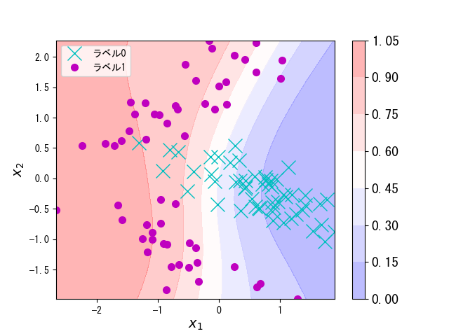
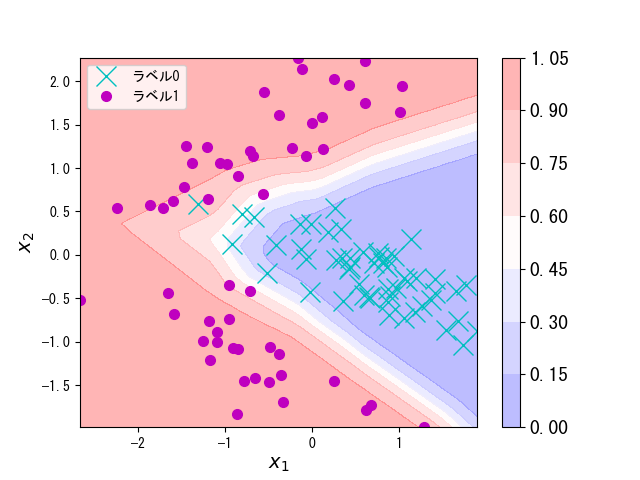
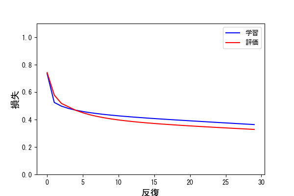
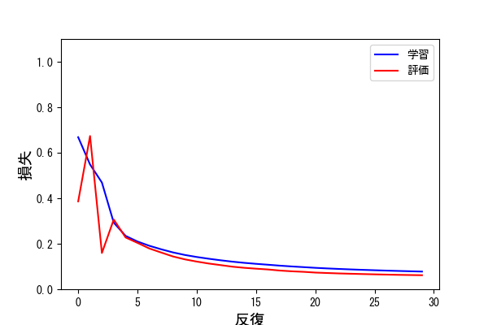
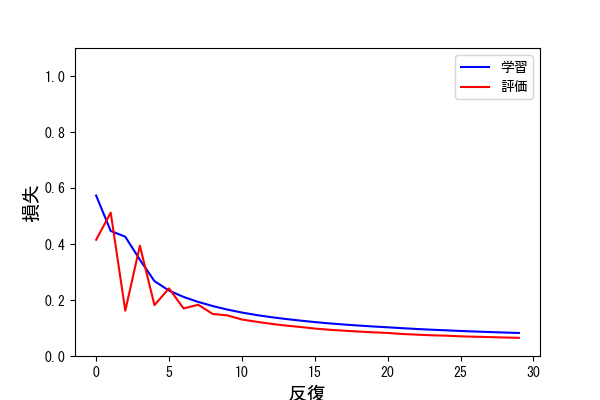

# 3-layer neural network
二値の分類問題を解く，三層のニューラルネットワーク<br>
令和７年度　アドバンスドビジョン　課題

## 用いたサンプルプログラム
「機械学習スタートアップシリーズ　ゼロからつくるＰｙｔｈｏｎ機械学習プログラミング入門」を参考に記載されているサンプルプログラムをアレンジした．
https://www.kodansha.co.jp/book/products/0000276037

1. neuralNetwork.py:：三層のニューラルネットワークのクラス
2. neuralNetworkMain.py：ニューラルネットワークのクラスのモジュールの読み込みと実行
3. data.py：学習に用いる人工データの読み込み

## 行ったこと
参考書には，活性化関数にシグモイド関数とReLU関数が載っていたので，leaky-ReLU関数を追加し，実行した．<br>
leaky-ReLU関数は，ReLU関数の負の入力に対してノードの勾配が０になってしまい，学習が進まないところを，微小な勾配を残すことで学習を継続させるという特徴がある．以下が書く活性化関数の数式になる．

シグモイド関数
$$
h_l = \sigma(s_l) = \frac{1}{1 + \exp(-s_l)}
$$

ReLU関数
$$
h_l = \operatorname{ReLU}(s_l) =
\begin{cases}
 s_l & s_l > 0 \\
 0 & s_l \le 0
\end{cases}
$$

leaky-ReLU関数（今回追加したもの）
$$
h_l = \operatorname{L-ReLU}(s_l) =
\begin{cases}
 s_l & s_l > 0 \\
 as_l & s_l \le 0
\end{cases}
$$

※変数は参考書のもので，$s$が１つ下のニューロンからの入力の総和であり，$h$は活性化関数を通した後の出力．


## 実行結果
ハイパーパラメータは以下の様に設定し，30回の反復処理を行った．
学習データは境界線が「C」の形状をした人口のデータを用いた．
```
hDim = 20       # 中間層のノード数
alpha = 1       # 学習率
```

### 学習データとニューラルネットワークの予測値$p_i$
シグモイド関数（正解率=0.83）<br>


ReLU関数（正解率=1.00）<br>


leaky-ReLU関数（正解率=1.00）<br>


### 評価データに対する平均交差エントロピー損失の推移
シグモイド関数（損失=0.33）<br>


ReLU関数（損失=0.06）<br>


leaky-ReLU関数（損失=0.06）<br>


ReLU関数とleaky-ReLU関数では特に差が見られなかった．
